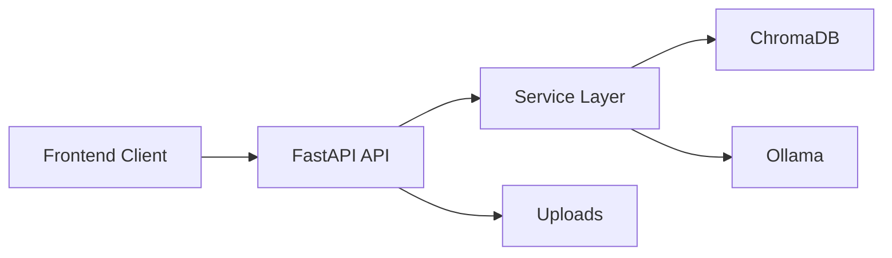

# AI PDF Assistant (RAG)

A production-oriented AI PDF Assistant built with FastAPI, LangChain, Ollama, ChromaDB, and a modern React frontend.

## Current Status

Completed modules:

- Project structure cleanup with a backend-first architecture.
- Secure PDF upload backend.
- PDF text extraction service.
- Text chunking service for retrieval-ready page citations.
- Chroma vector repository for chunk persistence and semantic search.
- Document indexing pipeline from stored PDF to vectorized chunks.
- Semantic search API with source-ready chunk citations.
- RAG chat API with grounded answers and citations.
- Streaming RAG chat API using server-sent events.
- Document library API for listing and deleting uploaded PDFs.

## Architecture

```text
AI-PDF-Assistant/
  backend/
    app/
      api/
        routes/
      config/
      core/
      database/
      middleware/
      models/
      repositories/
      schemas/
      services/
      utils/
    chroma_db/
    tests/
    uploads/
  docker/
  docs/
    samples/
  frontend/
    public/
    src/
  scripts/
```



## Backend Setup

```bash
python -m venv venv
source venv/bin/activate
pip install -r backend/requirements.txt
cp backend/.env.example backend/.env
uvicorn backend.app.main:app --reload
```

Health check:

```bash
curl http://localhost:8000/api/v1/health
```

## Tests

```bash
python -m pytest backend/tests
```

Expected result:

```text
1 passed
```

## Environment Variables

| Variable | Purpose |
| --- | --- |
| `APP_NAME` | Public application name |
| `APP_VERSION` | Application version |
| `ENVIRONMENT` | `development`, `test`, `staging`, or `production` |
| `APP_DEBUG` | Enables debug logging and FastAPI debug mode |
| `BACKEND_CORS_ORIGINS` | Comma-separated frontend origins |
| `UPLOAD_DIR_NAME` | PDF upload storage directory |
| `CHROMA_DIR_NAME` | Local vector database directory |
| `MAX_UPLOAD_SIZE_MB` | Upload size limit |
| `CHUNK_SIZE` | Target text chunk size used before embedding |
| `CHUNK_OVERLAP` | Character overlap between adjacent chunks |
| `OLLAMA_BASE_URL` | Local Ollama API URL |
| `LLM_MODEL` | Chat model name |
| `EMBEDDING_MODEL` | Embedding model name |

## Roadmap

- Multi-knowledge-base document model
- RAG chat endpoint with streaming responses
- React SaaS dashboard and chat UI
- Deployment guide and Docker Compose

## API

Upload one or more PDFs:

```bash
curl -X POST http://localhost:8000/api/v1/documents/upload \
  -F "files=@docs/samples/frontend.pdf;type=application/pdf"
```

List uploaded PDFs:

```bash
curl http://localhost:8000/api/v1/documents
```

Delete an uploaded PDF:

```bash
curl -X DELETE http://localhost:8000/api/v1/documents/<stored-filename>
```

Index an uploaded PDF:

```bash
curl -X POST http://localhost:8000/api/v1/documents/<stored-filename>/index
```

Search indexed PDFs:

```bash
curl -X POST http://localhost:8000/api/v1/search \
  -H "Content-Type: application/json" \
  -d '{"query":"payment total","limit":5}'
```

Ask a grounded question:

```bash
curl -X POST http://localhost:8000/api/v1/chat \
  -H "Content-Type: application/json" \
  -d '{"question":"What is the payment total?","limit":5}'
```

Stream a grounded answer:

```bash
curl -N -X POST http://localhost:8000/api/v1/chat/stream \
  -H "Content-Type: application/json" \
  -d '{"question":"What is the payment total?","limit":5}'
```

## Screenshots

Screenshots will be added after the frontend module is implemented.

## Troubleshooting

- If imports fail, run commands from the repository root.
- If Ollama calls fail in later modules, ensure Ollama is running and the configured models are pulled.
